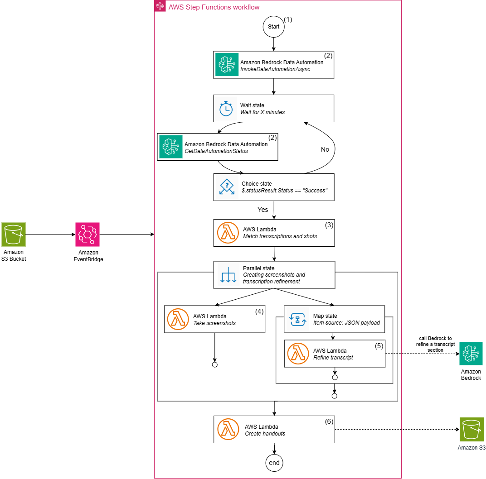

# Automate the creation of handout notes for educators using Amazon Bedrock Data Automation

The AWS Cloud Development Kit (AWS CDK) stack deploys an AWS Step Functions [state machine](https://docs.aws.amazon.com/step-functions/latest/dg/welcome.html) to orchestrate the creation on handout notes from a presentation video recording. The project uses a combination of [AWS Lambda](https://docs.aws.amazon.com/lambda/latest/dg/welcome.html) functions and [Amazon Bedrock Data Automation (BDA)](https://docs.aws.amazon.com/bedrock/latest/userguide/bda.html). BDA analyzes the video recording to extract key information, including the spoken transcript and timestamps for slide transitions.

## Solution overview
The following architecture shows what the solution deploys to your account:



## Deployment prerequisites
The solution uses the CDK in TypeScript to deploy the resources into your AWS account:

- The [AWS CLI](https://docs.aws.amazon.com/streams/latest/dev/setup-awscli.html) installed and configured
- The [CDK](https://docs.aws.amazon.com/cdk/v2/guide/getting_started.html) installed (TypeScript)
- [Make](https://www.gnu.org/software/make/) installed
- You have AWS IAM permissions for AWS Step Functions, IAM, AWS Lambda, Amazon S3 and Amazon Bedrock.


> **_NOTE:_** Amazon Bedrock Data Automation is only available in the Oregon (us-west-2) and North Virginia (us-west-1) regions. 

--- 

## Deploying the solution

If you have never previously used the CDK in your account, run:

```
cdk bootstrap
```

Then, use the provided Makefile to deploy the solution:
```
make full-deploy-setup
```

This command will install the required node modules and deploy the CDK Stack

---

## Using the solution

To use the solution, first retrieve the name of the Input S3 bucket that has been created. You can find it as the output of the stack creation in your terminal or on the CloudFormation console. It should have the following structure:

```
bda-blog-input-<ACCOUNT-NUMBER>-<TIME-NOW>
```

We have prepared for you a [test video](./BDA-sample-video.mp4) to use for running this solution. To trigger the solution workflow, upload the video to the input S3 bucket by running the following command:

```
aws s3 cp BDA-sample-video.mp4 s3://S3-BUCKET_NAME
```

You can follow the progress of the state machine on the Step Functions console. If you'd like to use your own video, replace the video file path with your own.

## Deleting the solution

To delete the solution, simply run:

```
make delete-stack
```

The command first runs a [shell script](/scripts/delete-buckets.sh) to delete all objects and their versions inside the input and output buckets, and then destroys the CDK stack.

## Creating the Lambda ZIP deployment for the Screenshot generation Lambda

Download the latest release Ffmpeg static build file from https://johnvansickle.com/ffmpeg/ and extract the content using
```
tar -xvf ffmpeg-release-amd64-static.tar.xz
```

Create a project directory with the structure:
```
project/
├── bin/ # Contains the FFmpeg binary
│ └── ffmpeg
├── lambda_function.py # Lambda function code
└── requirements.txt # Python dependencies
```
You can get the ffmpeg binary from the extracted files in Step 1.


Add those two dependencies into requirements.txt

```
ffmpeg-python requests
```


Create a package folder and install dependencies into it
```
mkdir package
pip install -r requirements.txt -t ./package
```

Copy your AWS Lambda code and the binary into the package
```
cp lambda_function.py ./package/
cp -r bin ./package/
```
Package should look something like:
```
package/
├── bin/
│ └── ffmpeg # The FFmpeg binary
├── lambda_function.py # Your Lambda function code
├── ffmpeg/ # ffmpeg-python library
├── requests/ # requests library
├── ... # Other dependencies
```

Create a .zip file and upload it to Lambda
```
cd package
zip -r ../lambda_function.zip .
cd ..
```

## Creating the Lambda layer of the Handout generation Lambda 

### Step 1: Install Docker (if not pre-installed)

Run the following commands to ensure Docker is installed and running. If your OS doesn't use yum as the packagame manager, change the commands as appropriate.
```
sudo yum update -y
sudo yum install docker -y
sudo service docker start
sudo usermod -a -G docker ec2-user
```

Note: You might need to log out and back in for the Docker permissions to take effect:
```
exit
```

### Step 2: Create the Dockerfile

Create a project directory:
```
mkdir lambda-layer
cd lambda-layer
```

Create the Dockerfile using a text editor:
```
touch Dockerfile
nano Dockerfile
```

Paste the following contents into the Dockerfile: (the image below is taken from the aws documentation: https://docs.aws.amazon.com/serverless-application-model/latest/developerguide/serverless-image-repositories.html) 
```
# Use the Python 3.13 Lambda base image
FROM public.ecr.aws/sam/build-python3.13:1.137.0-20250408011213

# Set a working directory
WORKDIR /layer
 
# Install zip utility using microdnf
RUN microdnf install zip -y
 
# Install python-pptx and dependencies
RUN pip install python-pptx -t python
 
# Package the layer in a ZIP format
RUN zip -r /layer/python-pptx-layer.zip python
 
# Final command to output the ZIP file to the host
CMD ["cp", "/layer/python-pptx-layer.zip", "/out/python-pptx-layer.zip"]·  
```

Save and exit the editor (Ctrl + O, Enter, Ctrl + X in nano).

### Step 3: Build the Docker image

Build the Docker image using the Dockerfile:
```
docker build -t lambda-layer .
```

Create an output directory to store the generated .zip file:
```
mkdir out
```

Run the Docker container to generate the .zip file:
```
docker run --rm --entrypoint /bin/sh -v $(pwd)/out:/out lambda-layer -c "cp /layer/python-pptx-layer.zip /out/python-pptx-layer.zip"
```

The python-pptx-layer.zip file will be available in the out directory. You can download it and then upload it as a Lambda layer using the AWS console.

